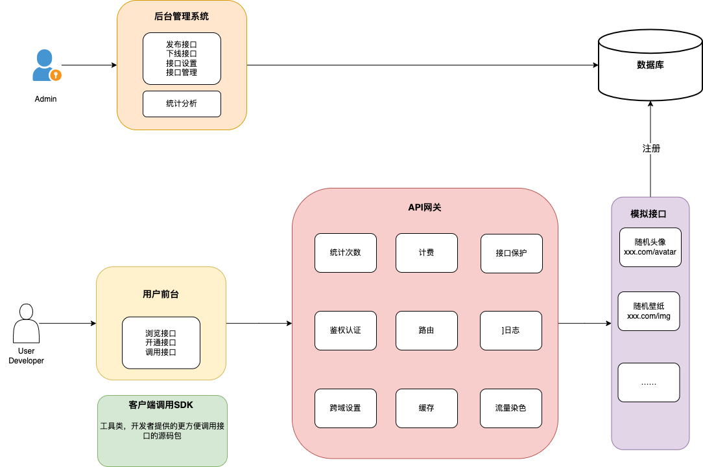
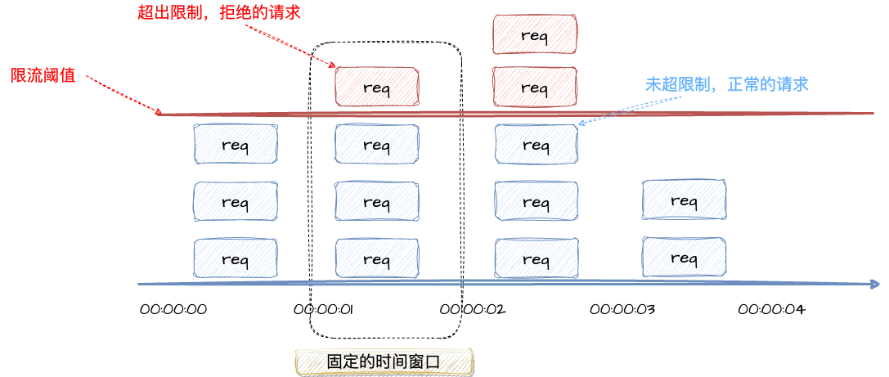
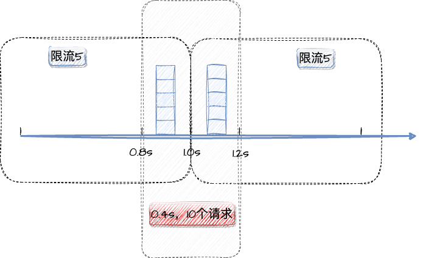
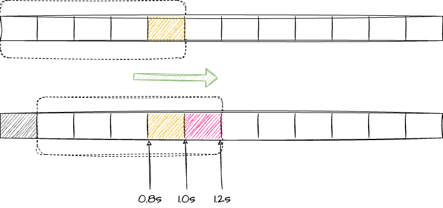
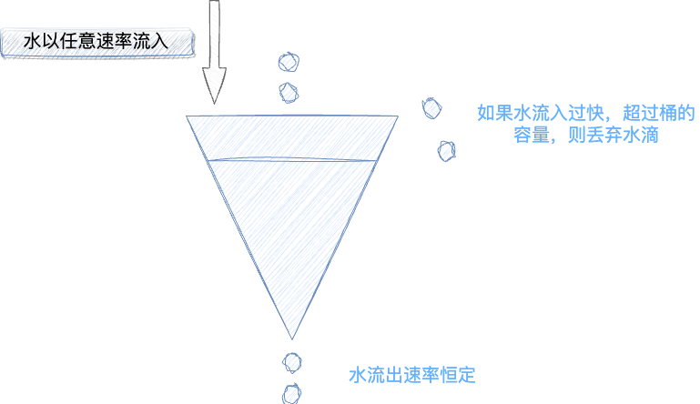
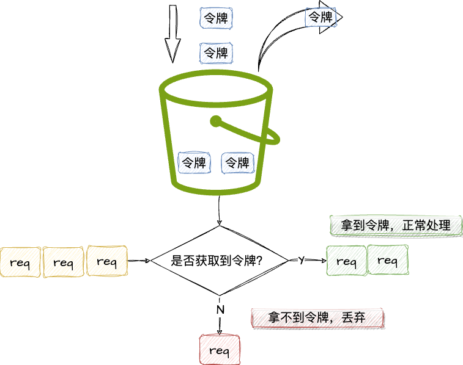

# JU-CONNECT

## 项目背景

1. 前端开发需要调用后台的接口
2. 使用现成的系统功能，就比如：http://api.btstu.cn/

==> **做一个API接口平台**

- 考虑安全性，防止攻击
- 不能随意调用（限流、开通服务）
- 统计调用次数
- 计费
- 流量保护
- API接口接入
- ……

## 项目介绍

一个提供API接口调用的平台，用户可以注册登录、开通接口调用权限。用户可以使用接口，并且每次调用会进行统计。管理员可以发布接口、下线接口、接入接口，以及可视化接口的调用情况、数据。

## 项目流程



## 项目结构

```
.
├── Dockerfile
├── LICENSE
├── README.md
├── assets
├── doc
│   └── sql
│       ├── create_table.sql
│       └── data.sql
├── ju-connect-common
├── ju-connect-dubbo-api
├── ju-connect-gateway
├── ju-connect-model
├── ju-connect-web
├── other-module
│   ├── Mock-Interface
│   └── Mock-Interface-SDK
└── pom.xml
```

## 快速启动

1. 打开`Mock-Interfae-SDK`项目，执行`mvn install`，本地安装SDK依赖
2. 打开`Mock-Interface`项目，修改`application.yml`配置（适合自己的环境），启动即可
3. 执行`doc/sql`目录下的两个SQL文件
4. 打开`Ju-Connect-backend`项目，修改web模块下`application-dev.yml`中的数据库配置、Nacos配置、Dubbo配置，修改gateway模块下`application-dev.yml`的Nacos配置、Dubbo配置
5. 启动Gateway模块和Web模块
6. 访问`http://localhost:port/api/doc.html`，其中ip为web模块启动的端口号
7. 在Knife4j界面调试即可

## 项目亮点

1. 根据业务流程，将整个项目后端划分为 web 系统、模拟接口、公共模块、客户端 SDK、API 网关这 5 个子项目，并使用 Maven 进行多模块依赖管理和打包。
2. 后端使用 Swagger + Knife4j 自动生成 OpenAPI 规范的接口文档，前端在此基础上使用插件自动生成接口请求代码，降低前后端协作成本。
3. 为防止接口被恶意调用，设计 API 签名认证算法，为用户分配唯一 ak / sk 以鉴权，保障调用的安全性、可溯源性（指便于统计接口调用次数）。
4. 为解决开发者调用成本过高的问题（须自己使用 HTTP + 封装签名去调用接口，平均 20 行左右代码），基于 Spring Boot Starter 开发了客户端 SDK，一行代码 即可调用接口，提高开发体验。
5. 选用 Spring Cloud Gateway 作为 API 网关，实现了路由转发、访问控制、流量染色，并集中处理签名校验、请求参数校验、接口调用统计等业务逻辑，提高安全性的同时、便于系统开发维护。
6. 为解决多个子系统内代码大量重复的问题，抽象模型层和业务层代码为公共模块，并使用 Dubbo RPC 框架实现子系统间的高性能接口调用，大幅减少重复代码。

# Core

## API 签名认证

> 为防止接口被恶意调用，设计 API 签名认证算法，为用户分配唯一 ak / sk 以鉴权，保障调用的安全性、可溯源性（指便于统计接口调用次数）。

### 详细说明

思考一个重要的问题：如果我们为开发者提供了一个接口，却对调用者一无所知。假设我们的Server只能允许100个人同时调用接口。如果有攻击者疯狂请求这个接口，这是很危险的。一方面可能会损害我们的安全性，另一方面也可能耗尽Server性能，影响正常用户使用。

因此我们必须为接口设置保护措施，例如限制每个用户每秒只能调用十次接口，即实施请求频次的限额控制。如果在后期，我们的业务扩大，可能还需要收费。因此，我们必须知道谁在调用接口，并且不能让无权限的人随意调用。

现在，我们需要设计一个方法，来确定谁在调用接口。在我们之前开发后端时，我们会进行一些权限检查。例如，当管理员执行删除操作时，后端需要检查这个用户是否为管理员。那么，我们如何获取用户信息呢？是否直接从后端的 session 中获取？但问题来了，当我们调用接口时，我们有 session 吗？比如说，我是前端直接发起请求，我没有登录操作，我没有输入用户名和密码，我怎么去调用呢？因此，一般情况下，我们会采用一个叫API签名认证的机制。这是一个重要的概念。 

那么，什么是 API 签名认证？简单地说，如果你想来我家做客，我不可能随便让任何陌生人进来。所以我会提前给你发一个类似于请帖的东西，作为授权或许可证。当你来访问我的时候，你需要带上这个许可证。我可能并不认识你，但我认识你的请帖。只要你有这个请帖，我就允许你进来。

所以，API签名认证主要包括两个过程，第一是签发签名，第二是使用签名和校验签名。

为什么需要？为了保证安全性，不能让任何人都可以调用接口。

如何在后端实现签名认证了？我们需要两个东西，即accessKey和secretKey。这跟用户名和密码类似，不过每次调用接口都需要带上，实现无状态的请求。这样，即使之前没有来过，这次的状态正确也可以调用接口，所以我们需要这两个东西来标识用户。

### API 签名认证总结

**本质：**

1. 签发签名
2. 使用签名（校验签名）

**为什么需要：**

1. 保证安全性，不能随便调用
2. 适用于无需保存登陆态的场景，只认签名，不关注用户登陆态

#### 签名认证实现

通过 Http Request Header 传递参数

- 参数1：accessKey，调用的标识 userA, userB（复杂、无序、无规律）
- 参数2：secretKey，密钥（复杂、无序、无规律），该参数不能放到请求头中

（类似用户名和密码，区别：AK和SK是无状态的）

- 参数3：用户请求参数
- 参数4：sign，签名

#### 加密方式

对称加密、非对称加密、MD5摘要

用户参数 + 密钥 => 签名生成算法（MD5, HMac, Sha1等）=> 不可解密的值

**怎么知道签名是否正确？**

服务端用一摸一样的参数和算法生成签名，只要和用户传递的一致，就表示正确。

**如何防止重放？**

- 参数5：nonce，随机数，只能用一次，服务端要保存使用过的随机数
- 参数6：timestamp，时间戳，校验时间戳是否过期

第一种方式是通过**加入一个随机数实现标准的签名认证**。每次请求时，发送一个随机数给后端。后端只接受并认可该随机数一次，一旦随机数被使用过，后端将不再接受相同的随机数。这种方式解决了请求重放的问题，因为即使对方使用之前的时间和随机数进行请求，后端会认识到该请求已经被处理过，不会再次处理。然而，这种方法需要后端额外开发来保存已使用的随机数。并且，如果接口的并发量很大，每次请求都需要一个随机数，那么可能会面临处理百万、千万甚至亿级别请求的情况。因此，除了使用随机数之外，我们还需要其他机制来定期清理已使用的随机数。 

第二种方式是**加入一个时间戳（timestamp）**。每个请求在发送时携带一个时间戳，并且后端会验证该时间戳是否在指定的时间范围内，例如不超过10分钟或5分钟。这可以防止对方使用昨天的请求在今天进行重放。通过这种方式，我们可以一定程度上控制随机数的过期时间。因为后端需要同时验证这两个参数，只要时间戳过期或随机数被使用过，后端会拒绝该请求。因此，时间戳可以在一定程度上减轻后端保存随机数的负担。通常情况下，这两种方法可以相互配合使用。 

因此，在标准的签名认证算法中，建议至少添加以下五个参数：accessKey、secretKey、sign、nonce（随机数）、timestamp（时间戳）。此外，建议将用户请求的其他参数，例如接口中的 name 参数，也添加到签名中，以增加安全性。

> API签名认证是一个很灵活的设计，具体要有哪些参数、参数名要根据实际的场景来（比如userId、appId、version、固定值等）

**为什么需要两个Key？**

如果仅凭一个Key就可以调用接口，那么任何拿到这个Key的人都可以无限制的调用这个接口。这就好比，为什么你在登录网站的时候需要输入密码，而不是仅仅输入用户名就可以了？这二者的原理是一样的。

**安全传递性**

密钥一定不能传递。也就是说，在向对方发送请求时，密钥绝对不能以明文的形式传递，必须通过特殊的方式进行传递。在标准的API签名认证中，我们需要传递一个签名，这个签名是根据密钥生成的。


## SDK

### 为什么需要Starter？

理想情况：开发者只需要关心调用那些接口、传递哪些参数，就跟调用自己写的代码一样简单。

开发Starter的好处：开发者引入Starter之后，可以直接在`application.yml`中写配置，自动创建客户端。

**进一步说明**

为了方便开发者的调用，我们不能让他们每次都自己编写签名算法，这显然很繁琐。因此，我们需要开发一个简单易用的 SDK，使开发者只需关注调用哪些接口、传递哪些参数，就像调用自己编写的代码一样简单。实际上，RPC（远程过程调用）就是为了实现这一目的而设计的。RPC它就是追求简单化调用的理想情况。类似的例子是小程序开发或者调用第三方 API，如腾讯云的 API，它们都提供了相应的 SDK。


### 如何开发Starter？

- 确认所需要的依赖，需要引入`spring-boot-configuration-processor`（配置文件编写提示）
- 过程代码编写
- 配置类编写
- 在`resources`目录下创建`META-INF/spring.factories`，其中配置自动配置类`org.springframework.boot.autoconfigure.EnableAutoConfiguration=xxx`

```java
@Data
@Configuration
@ConfigurationProperties("juzi.api.client")
@ComponentScan
public class MockApiConfig {
    private String accessKey;
    private String secretKey;

    @Bean
    public MockApiClient mockApiClient() {
        return new MockApiClient(accessKey, secretKey);
    }
}
```

```spring.factories
org.springframework.boot.autoconfigure.EnableAutoConfiguration=\
  com.juzi.sdk.config.MockApiConfig
```

> 明确一个**核心点**：一旦接口投入使用后，肯定要针对这个接口进行 SDK 的开发。你需要不断地完善 SDK，使其适应不断变化的需求。当然，也可以让 SDK 从接口信息表中读取信息，然后动态生成方法等等，这种做法也是可行的，然而，并不建议这样做。实际上，接口的发布可能不太像我们在应用商店发布应用那样灵活，在这种接口的发布过程中，建议还是介入一点人工。
>
> 每次发布一个新的接口，都需要对 SDK 进行更新。建议的做法是这样的：由于用户并不关心具体的接口地址，因此你可以让他们直接调用方法名，然后根据这些方法名去动态生成对应的方法。每次发布新接口时，更新 SDK 的操作可以做得非常简单，可以采用脚本的方式，从数据库中读取接口地址，与之前已有的地址进行对比，然后补充相应的方法，这个过程是可行的，事实上，很多公司都在这样做。

## RPC

问题：网关项目比较纯净，没有操作数据库的包，并且还要调用之前写过的代码，复制粘贴比较麻烦

理想：直接请求道其他项目的方法

**怎么调用其他项目的方法？**

- 复制代码和依赖、环境
- HTTP请求（提供一个接口，供其他项目调用）
- RPC
- 把公共的代码打成Jar包，其他项目去应用（客户端SDK）

**RPC**

作用：像调用本地方法一样调用远程方法

和直接HTTP调用的区别：

- 对开发者更透明，减少了很多沟通成本
- RPC向远程服务器发送请求的时候，未必需要使用HTTP协议，比如还可以使用TCP / IP协议，性能更高（内部服务更适用）

**进一步说明**：

RPC 和 HTTP 请求在本质上有一些区别。RPC 相对于 HTTP 请求更加透明，这意味着它在开发者间更具透明度。这种透明性是如何理解的呢？一个广泛的定义是，RPC 的目标是使远程方法的调用就像调用本地方法一样，从而实现更为便捷的远程通信。 

以 HTTP 请求为例，调用方需要完成诸多步骤。首先，它需要发送 HTTP 请求，使用一个 HTTP 客户端的代码库。以我们的sdk项目为例，我们可以看到客户端对象是如何使用 HTTPUtil 这个 hutool 工具类的包来发送请求的，这意味着调用方需要编写特定的代码段来发送请求，然后处理返回值，可能还需要解析返回值并封装参数的映射关系等。

如果我们使用 RPC 方式，就能够实现与调用本地方法类似的体验。你可以直接指定要传递的参数，并且也能够直接获得返回值，无论是布尔类型还是字符串。RPC 方式不需要像 HTTP 请求那样进行额外的封装，但如果你需要封装，当然也可以根据需求自行处理。

> **feign 不也是动态生成的 httpclient 吗？** 
>
> Feign 本质上也是动态生成的 HTTP 客户端，但它在调用远程方法时更加精简了 HTTP 请求的步骤。尽管 Feign 使远程调用看起来像是调用本地方法，但实际上与 RPC 仍然有一些微小的区别。虽然两者都可以实现类似的功能，但它们在底层协议上存在差异。 
>
> RPC(Remote Procedure Call 远程过程调用) 的一个关键优势在于，它可以使用多种底层协议进行远程调用，而不限于 HTTP 协议。虽然 HTTP 协议可以实现类似的功能，但考虑到性能，RPC 可以选择更原生的协议，如 TCP/IP。而且，网络上还存在其他性能更高的协议，可以根据需要进行选择。 在微服务项目中，对于内部接口，使用 RPC 可能会获得更好的性能。然而，选择使用 Feign 还是 RPC 取决于具体的技术需求，没有绝对的优劣之分。需要注意的是，RPC 和 HTTP 请求可以结合使用，因为 RPC 的底层协议可以是 HTTP，也可以是其他协议，如 TCP/IP 或自定义协议。 
>
> 综上所述，RPC 和 HTTP 请求是可以互相结合的，但 RPC 在协议的选择上更加灵活。


## 限流

> 为了保证接口调用的性能、稳定性和可用性，在网关层面通过Redisson的RateLimiter实现限流保护（1s最多请求1次）

我们需要控制用户使用系统的次数，以避免超支。但是限制用户调用次数仍存在一定风险，用户仍有可能疯狂调用来刷量，从而导致系统成本过度消耗。

限流（流量控制）：指系统在面临高并发，或者**大流量请求**的情况下，**限制新的请求对系统的访问**，从而**保证系统的稳定性**。限流会导致部分用户请求处理不及时或者被拒绝，影响了用户体验，所以一般需要在系统稳定和用户体验之间选择平衡。

**问题**：使用系统是需要消耗成本的，用户有可能疯狂刷量

**解决方案**：

1. 控制成本 => 限制用户调用次数
2. 用户在短时间内疯狂使用，导致服务器资源被占满，其他用户无法使用 => 限流

### 常见的限流算法

#### 固定窗口限流算法

首先维护一个计数器，将单位时间段当做一个窗口，计数器记录这个窗口接收请求的次数

- 当次数小于限流阈值，就允许访问，并且计数器+1
- 当次数大于限流阈值，就拒绝访问
- 当前的时间窗口过去之后，计数器清零

【栗子🌰】假设单位时间是1秒，限流阈值是3。在单位时间1s内，每次来一个请求，计数器就+1，如果计数器累加的次数超过了限流阈值3，后续在1s内的请求全部拒绝。等到1s结束后，计数器清零，重新开始计数。



```java
/**
  * 固定时间窗口限流算法（伪代码）
  * 
  * @return true - 请求在阈值内，正常响应
  */
boolean fixedWindowsTryAcquire() {
  // 获取当前系统的时间
  long currentTime = System.currentTimeMillis();
  // 检查是否在时间窗口内
  if (currentTime - lastReqTime > windowUnit) {
    // 不在时间窗口内，计数器清零
    counter = 0;
    // 开启新的时间窗口
    lastReqTime = currentTime;
  }
  // 判断计数器是否小于阈值
  if (counter < threshold) {
    // 小于阈值，计数器 + 1，正常响应请求
    counter++;
    return true;
  }
  // 超过阈值，拒绝响应
  return false;
}
```

**问题：**

这种算法存在一个很明显的**临界问题**：假设限流阈值为5个请求，单位时间窗口是1s，若我们在单位时间内的前[0.8, 1)和[1, 1.2)时间段内，分别发送5个请求，虽然都没有超过阈值，但是如果算这[0.8, 1.2)时间段内，并发数高达10，**超过了单位时间1s不超过5阈值**的定义。



### 滑动窗口限流算法

滑动窗口限流解决了固定窗口限流临界问题。它将单位时间周期分成n个小周期，分别记录每个小周期内接口的访问次数，并且根据时间滑动删除过期的小周期。



假设单位时间还是1s，滑动窗口算法把它划分成5个小周期，也就是滑动窗口（单位时间）被划分为5个小区间。每个区间代表0.2s。每过0.2s，时间窗口就会往右滑动一格。每个小周期都有自己独立的计数器，假设请求是在0.85s到达的，[0.8, 1.0)对应的计数器+1。

滑动窗口是如何解决固定窗口临界问题的呢？

假设1s内的限流阈值还是5，[0.8, 1.0)内来了5个请求，落在黄色格子内，时间点过了1.0s点之后，又来了5个请求，落在了虹色格子内。如果是**固定窗口算法，是不会触发限流的**，但是**滑动窗口每过一个小周期，它会右移一小格**。过了1.0s这个点后，右移一小格，也就是当前的单位时间段为[0.2, 1.2)，这个时间段内的请求已经超过阈值限定5了，触发了限流。实际上，红色格子的请求都会被拒绝。

> 当滑动窗口的格子周期划分的越多，滑动窗口的滚动越平滑，限流的统计就会越精确。

```java
/**
  * 单位时间划分的小周期秒数（单位时间是1分钟，10s一个小格子窗口，一共6个格子）
  */
private int SUB_CYCLE = 10;

/**
  * 每分钟限流阈值
  */
private int perMinThreshold = 100;

/**
  * 计数器 {当前窗口的开始时间（秒）: 当前窗口的计数值}
  */
private final TreeMap<Long, Integer> COUNTER = new TreeMap<>();

/**
  * 滑动窗口时间算法实现（伪代码）
  * 
  * @return true - 请求在阈值内，正常响应
  */
boolean slidingWindowsTryAcquire() {
  // 获取当前时间在哪个小周期窗口
  long currentWindowTime = LocalDateTime.now().toEpochSecond(ZoneOffset.UTC) / SUB_CYCLE * SUB_CYCLE;
  int currWindowCount = countCurrWindow(currentWindowTime);

  // 判断是否超过阈值
  if (currWindowCount > perMinThreshold) {
    return false;
  }

  // 计数器 + 1
  COUNTER.put(currentWindowTime,
              (Objects.isNull(COUNTER.get(currentWindowTime)) ? 0 : CUNTER.get(currentWindowTime)) + 1);
  return true;
}

/**
  * 统计当前窗口的计数值
  */
private int countCurrWindow(long currentWindowTime) {
  // 计算窗口开始位置
  long startTime = currentWindowTime - SUB_CYCLE * (60 / SUB_CYCLE - 1);
  int count = 0;

  Iterator<Map.Entry<Long, Integer>> iterator = COUNTER.entrySet().iterator();
  while (iterator.hasNext()) {
    Map.Entry<Long, Integer> entry = iterator.next();
    // 删除无效过期的子窗口计数器
    if (entry.getKey() < startTime) {
      iterator.remove();
    } else {
      // 累加当前窗口的所有计数器之和
      count += entry.getValue();
    }
  }
  return count;
}
```

滑动窗口限流算法虽然解决了**固定窗口的临界问题**，但是一旦到达限流后，请求都会直接暴力被拒绝，这样子我们会损失一部分请求，这对于产品来说，不太友好。

### 漏桶算法

漏桶算法面对限流，更加具有柔性，不存在直接的暴力拒绝。

原理：就是**注水漏水**的过程。往漏桶中以任意速率注水，以固定的速率漏水。当水超过桶的容量时，就会溢出，也就是被丢弃。因为桶的容量是不变的，保证了整体的速率。



几点说明：

1. 流入的水，可以看做是访问系统的请求，这个流入速率是不确定的
2. 桶的容量一般表示系统所能处理的请求数
3. 如果桶的容量满了，就是达到限流的阈值，丢弃水（拒绝请求）
4. 水流出的速率是恒定的，对应系统按照固定的速率处理请求

```java
/**
  * 每秒处理请求数（出水率）
  */
private long rate;

/**
  * 当前剩余水量
  */
private long currentWater;

/**
  * 最后刷新时间
  */
private long refreshTime;

/**
  * 桶容量
  */
private long capacity;

/**
  * 漏桶算法（伪代码）
  * 
  * @return true - 请求在阈值内，正常响应
  */
boolean leakyBucketLimitTryAcquire() {
  // 获取当前时间
  long currentTime = System.currentTimeMillis();
  // 流出的水量 = （当前时间 - 上次刷新时间）* 出水率 
  long outWater = (currentTime - refreshTime) / 1000 * rate;
  // 当前水量 = 之前桶内水量 - 流出的水量
  long currentWater = Math.max(0, currentWater - outWater);
  // 刷新时间
  refreshTime = currentTime;
  // 判断剩余水量是否小于桶的容量
  if (currentWater < capacity) {
    // 小于，请求放行
    currentWater++;
    return true;
  }

  // 溢出，限流
  return false;
}
```

在正常流量的时候，系统按照我们固定的速率处理请求，这是我们想要的。但是**面对突发流量**的时候，漏桶算法还是在循规蹈矩的处理请求，这就不是我们想要的。

### 令牌桶算法

面对**突发流量**时，我们可以使用令牌桶算法限流。

**算法原理**：

1. 有一个令牌管理员，根据限流大小，定速像令牌桶中放入令牌
2. 如果令牌数量满了，超过令牌桶容量的限制，那就丢弃
3. 系统在接收到请求时，都会先去向令牌桶要一个令牌。如果拿到令牌，那么就处理这个请求
4. 如果拿不到令牌，拒绝这个请求



```java
/**
  * 每秒处理数（放入令牌速率）
  */
private long putTokenRate;

/**
  * 最后刷新时间
  */
private long refreshTime;

/**
  * 桶容量
  */
private long capacity;

/**
  * 当前桶内令牌数
  */
private long currentToken = 0L;

/**
  * 令牌桶算法
  * 
  * @return true - 请求在阈值内，正常响应
  */
boolean tokenBucketTryAcquire() {
  // 获取当前时间
  long currentTime = System.currentTimeMillis();

  // 计算生成的令牌数量
  long elapsedTime = currentTime - refreshTime;
  long generatedTokens = elapsedTime * putTokenRate / 1000; // 放入令牌速率是每秒处理的令牌数，因此需要除以1000转换为毫秒

  // 计算当前令牌数量，但不超过桶的容量
  currentToken = Math.min(capacity, currentToken + generatedTokens);

  // 更新刷新时间
  refreshTime = currentTime;

  // 判断是否有足够的令牌处理请求
  if (currentToken > 0) {
    // 消耗一个令牌
    currentToken--;
    return true;
  }

  // 限流
  return false;
}
```

如果令牌发放的策略正确，这个系统即不会被拖垮，也能提高机器的利用率。Guava的RateLimiter限流组件、Redisson的RRateLimiter组件，就是基于**令牌桶算法**实现的。
